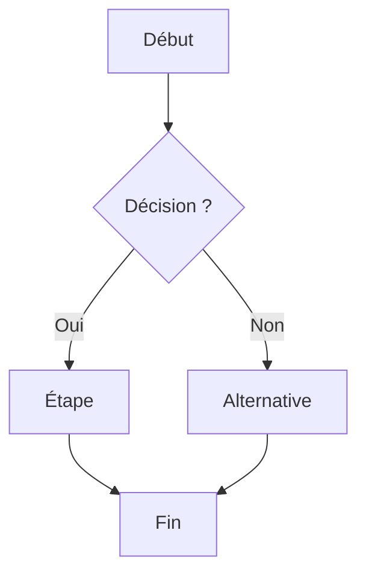

<!-- Frozen template (D-019, schema L3 — the core entity). A FEATURE is a catalogue
     row by default (depth: stub) = title + persona (links.related) + value_hypothesis,
     nothing else. Fill the PRD body below ONLY when depth: specified (reserved for
     `Now` items). Render in config.language; translate headings if "en"; strip every
     guidance comment.

     Frontmatter cheatsheet:
       type      : epic | feature | enhancement   (epic = parent of features)
       source    : discovered | inventoried        (greenfield vs brownfield audit)
       depth     : stub | specified                (specified ⇒ keep the PRD body)
       horizon   : Now | Next | Later | Done        → feeds the generated ROADMAP.md
       status    : idea | discovery | ready | building | shipped | deprecated
       parents   : parent epic (FEAT-*) and/or BRF-001
       related   : persona(s) PER-* (+ outcome/opportunity once activated)
       value_hypothesis : "We believe <X>, measured by <Y>." -->

# {{title}}

<!-- ===== PRD body — ONLY when depth: specified. Delete this whole block for a stub. ===== -->

## TL;DR
<!-- 3 lines: the deep-module interface. -->

## Problème & contexte
<!-- The need this solves (→ Opportunity once activated). -->

## Objectif & métrique
<!-- The outcome it moves (→ Outcome once activated); restate value_hypothesis. -->

## Périmètre — In / Out
<!-- What's in this increment, what's explicitly out. -->

## User flow
<!-- Mermaid flowchart (schema §5). Name the block flow-<feature-key>-<nom>. -->

## User stories
<!-- "As a <persona>, I want <capability>, so that <benefit>." Pushed to the board. -->

## Critères d'acceptation
<!-- Testable conditions of done. Given/When/Then preferred. -->

## Risques & questions ouvertes

## Hors-périmètre explicite

<!-- ===== End PRD body ===== -->
